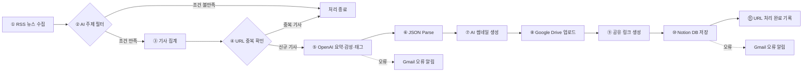
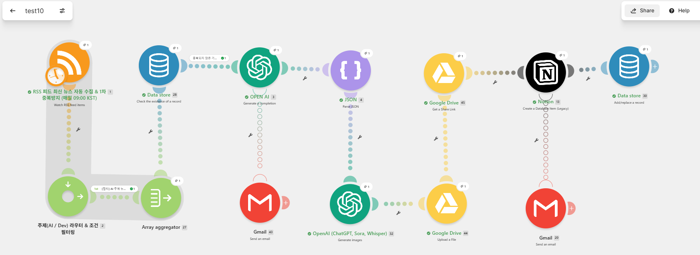
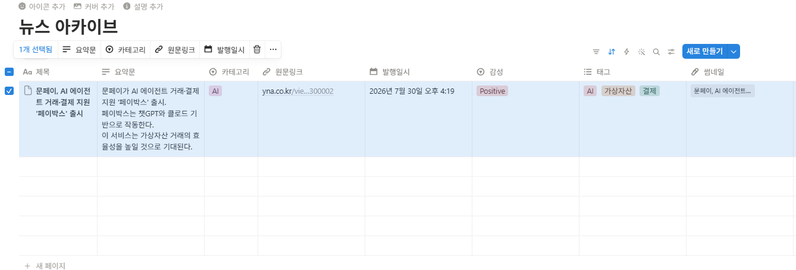

# AI 기술 뉴스 요약 자동화 파이프라인

> **Make 기반 노코드 자동화 팀 프로젝트 제출 문서**

| 항목 | 내용 |
|---|---|
| 제출 워크플로우 | `2팀 프로젝트.blueprint.json` |
| 자동화 도구 | **Make** |
| 주요 연동 | 연합뉴스 RSS · OpenAI · JSON · Google Drive · Notion · Gmail · Make Data Store |
| 실행 주기 | 매일 오전 09:00 (KST) |
| 팀원 | 김승현 · 이태우 · 한승학 · 공미순 · 최슬기 |

---

## 목차

1. [프로젝트 개요](#1-프로젝트-개요)
2. [전체 워크플로우 한눈에 보기](#2-전체-워크플로우-한눈에-보기)
3. [실제 구현 화면](#3-실제-구현-화면)
4. [단계별 구현 내용과 사용 이유](#4-단계별-구현-내용과-사용-이유)
5. [주제 필터링 기준](#5-주제-필터링-기준)
6. [OpenAI 가공 설계](#6-openai-가공-설계)
7. [보너스 기능 구현](#7-보너스-기능-구현)
8. [Notion 데이터베이스 저장 구조](#8-notion-데이터베이스-저장-구조)
9. [중복 방지 설계](#9-중복-방지-설계)
10. [오류 처리 정책](#10-오류-처리-정책)
11. [팀원별 역할 및 수행 결과](#11-팀원별-역할-및-수행-결과)
12. [요구사항 충족 현황](#12-요구사항-충족-현황)
13. [테스트 시나리오](#13-테스트-시나리오)
14. [보안 및 운영 유의사항](#14-보안-및-운영-유의사항)
15. [프로젝트 요약](#16-프로젝트-요약)

---

## 1. 프로젝트 개요

여러 뉴스 사이트를 사람이 직접 확인하고 기사 내용을 복사·정리하는 반복 업무를 줄이기 위해 제작한 **AI 기술 뉴스 수집·요약·저장 자동화 시스템**입니다.

매일 정해진 시간에 연합뉴스 RSS에서 최신 뉴스를 수집하고, AI 관련 키워드가 포함된 기사만 선별합니다. 이후 원문 URL을 기준으로 중복 여부를 확인한 뒤 OpenAI를 이용하여 기사 요약, 감성 분석, 태그 생성을 한 번에 수행합니다.

가공된 결과는 JSON 형식으로 구조화하며, 기사 내용을 표현하는 썸네일 이미지도 자동으로 생성합니다. 생성 이미지는 Google Drive에 업로드한 후 Notion 데이터베이스의 썸네일 속성과 연결합니다.

### 핵심 목표

| # | 목표 |
|---:|---|
| 1 | RSS 기반 최신 기술 뉴스 자동 수집 |
| 2 | AI 관련 기사만 키워드로 선별 |
| 3 | 원문 URL 기준 동일 기사 중복 저장 방지 |
| 4 | 기사 핵심 내용을 3줄 이내로 자동 요약 |
| 5 | 감성 분석과 주제 태그 자동 생성 |
| 6 | 뉴스 주제 기반 썸네일 자동 생성 |
| 7 | 결과를 Notion 데이터베이스에 자동 저장 |
| 8 | OpenAI·Notion 오류 발생 시 Gmail 알림 |
| 9 | 사람의 개입을 최소화한 End-to-End 자동화 |

---

## 2. 전체 워크플로우 한눈에 보기



### 데이터 흐름 요약

```text
연합뉴스 RSS
→ AI 키워드 필터링
→ 후보 기사 집계
→ Data Store URL 중복 확인
→ OpenAI 3줄 요약·감성·태그 생성
→ JSON 구조화
→ AI 썸네일 생성
→ Google Drive 업로드 및 공유
→ Notion 데이터베이스 저장
→ Data Store에 처리 URL 등록
```

---

## 3. 실제 구현 화면

### 3.1 Make 전체 워크플로우

아래 이미지는 RSS 수집부터 AI 가공, 썸네일 생성, Notion 저장 및 오류 알림까지 연결된 실제 Make 시나리오입니다.



| 구간 | 주요 모듈 |
|---|---|
| 수집·필터링 | RSS Watch → 주제 필터 → Array Aggregator |
| 중복 검사 | Data Store · Check existence |
| 텍스트 가공 | OpenAI Completion → JSON Parse |
| 이미지 생성 | OpenAI Generate Images |
| 이미지 저장 | Google Drive Upload → Share Link |
| 최종 저장 | Notion Create a Database Item |
| 처리 완료 기록 | Data Store Add/Replace a Record |
| 오류 알림 | Gmail Send an Email |

### 3.2 Notion 저장 결과

아래 이미지는 자동화 실행 후 Notion의 **뉴스 아카이브** 데이터베이스에 저장된 실제 결과입니다.



제목, 요약문, 카테고리, 원문링크, 발행일시, 감성, 태그 및 썸네일 속성이 한 행에 자동으로 저장된 것을 확인할 수 있습니다.

---

## 4. 단계별 구현 내용과 사용 이유

| 순서 | Make 모듈 | 모듈 ID | 수행 기능 | 사용한 이유 |
|---:|---|---:|---|---|
| 1 | RSS · Watch RSS feed items | 1 | 연합뉴스 RSS에서 최신 기사 수집 | 웹 크롤링 없이 공식 RSS 데이터를 안정적으로 가져오고, 정해진 시간에 자동 실행하기 위해 사용 |
| 2 | Router / Filter | 2 | AI·개발 관련 키워드가 포함된 기사만 통과 | 비관련 기사를 OpenAI에 보내지 않아 API 호출 횟수와 비용을 줄이기 위해 사용 |
| 3 | Array Aggregator | 27 | 필터를 통과한 기사를 배열로 집계 | 여러 RSS 번들을 하나의 후보 목록으로 묶고, 처리할 기사 1건을 안정적으로 선택하기 위해 사용 |
| 4 | Data Store · Check existence | 28 | 원문 URL이 기존에 처리되었는지 확인 | 같은 기사를 다시 요약하거나 Notion에 중복 저장하는 문제를 방지하기 위해 사용 |
| 5 | OpenAI · Generate a Completion | 3 | 3줄 요약, 감성, 태그 생성 | 기사 내용을 사람이 직접 읽고 분류하는 과정을 자동화하고, 한 번의 호출로 여러 결과를 생성하기 위해 사용 |
| 6 | JSON · Parse JSON | 4 | OpenAI 응답을 개별 필드로 분리 | `summary`, `sentiment`, `tags` 값을 Notion 속성에 정확하게 매핑하기 위해 사용 |
| 7 | OpenAI · Generate Images | 32 | 기사 요약을 기반으로 썸네일 생성 | 텍스트 중심의 뉴스 DB에 시각적 구분 요소를 추가하여 가독성과 활용도를 높이기 위해 사용 |
| 8 | Google Drive · Upload a File | 44 | 생성된 이미지 파일 업로드 | OpenAI에서 생성된 이미지 파일을 외부에서 접근 가능한 저장소에 보관하기 위해 사용 |
| 9 | Google Drive · Get a Share Link | 45 | 이미지 공유 링크 생성 | Notion의 파일·썸네일 속성에서 이미지를 표시할 수 있는 접근 URL을 만들기 위해 사용 |
| 10 | Notion · Create a Database Item | 13 | 기사 및 AI 가공 결과를 DB에 저장 | 제목·요약·링크·날짜·감성·태그·이미지를 한곳에서 검색하고 관리하기 위해 사용 |
| 11 | Data Store · Add/Replace a Record | 30 | 저장 완료 기사 URL 기록 | 정상 저장이 완료된 기사만 처리 이력에 등록하여 다음 실행의 중복 판단에 사용 |
| 오류 | Gmail · Send an Email | 43 | OpenAI 처리 실패 알림 | AI 호출 오류를 관리자가 즉시 인지하고 원인을 확인할 수 있도록 사용 |
| 오류 | Gmail · Send an Email | 20 | Notion 저장 실패 알림 | 최종 저장 단계의 오류를 별도로 구분해 관리자가 후속 조치할 수 있도록 사용 |

### 핵심 모듈 선택 이유 요약

**Data Store를 사용한 이유**  
중복 확인을 기사 제목이 아닌 원문 URL로 수행하면 제목이 일부 수정되더라도 동일 기사를 비교적 안정적으로 식별할 수 있습니다. Make 내부 기능이므로 별도 외부 데이터베이스도 필요하지 않습니다.

**JSON Parse를 사용한 이유**  
OpenAI의 답변을 단순 문장으로 받으면 요약, 감성, 태그를 각각 분리하기 어렵습니다. 응답 형식을 JSON으로 고정한 후 Parse JSON 모듈을 사용하면 각 값을 독립적인 데이터 필드로 다룰 수 있습니다.

**Google Drive를 사용한 이유**  
AI 이미지 생성 모듈의 결과를 Notion에 안정적으로 표시하려면 외부에서 읽을 수 있는 이미지 URL이 필요합니다. Google Drive에 이미지를 업로드하고 공유 링크를 생성하여 Notion 썸네일과 연결했습니다.

---

## 5. 주제 필터링 기준

기사의 **제목 또는 본문**에 아래 키워드가 하나 이상 포함되면 AI 기술 뉴스 후보로 선별합니다.

| 구분 | 적용 키워드 |
|---|---|
| 영문 | `AI`, `LLM`, `GPT`, `Machine Learning` |
| 한글 | `인공지능`, `딥러닝` |
| 검사 대상 | 기사 제목 및 본문 |
| 통과 조건 | 키워드 중 하나 이상 포함 |

### 키워드 선정 이유

1. **AI**, **인공지능**은 국내 기술 뉴스에서 가장 일반적으로 사용되는 표현입니다.
2. **LLM**, **GPT**는 생성형 AI와 대형 언어모델 관련 기사를 효과적으로 식별합니다.
3. **Machine Learning**, **딥러닝**을 포함하여 제목에 ‘AI’가 직접 표시되지 않은 기술 기사도 포착합니다.
4. OpenAI 호출 전에 필터링함으로써 불필요한 API 사용과 비용을 줄입니다.

---

## 6. OpenAI 가공 설계

### 6.1 텍스트 가공 설정

| 항목 | 설정 |
|---|---|
| 모델 | `gpt-4o-mini` |
| 응답 형식 | JSON Object |
| Temperature | `0.2` |
| 최대 출력 토큰 | `500` |
| 입력 본문 길이 | 최대 3,000자 |
| 처리 대상 | 필터를 통과한 후보 기사 중 1건 |

### 6.2 AI 출력 구조

```json
{
  "summary": [
    "첫 번째 핵심 요약",
    "두 번째 핵심 요약",
    "세 번째 핵심 요약"
  ],
  "sentiment": "positive",
  "tags": [
    "AI",
    "결제"
  ]
}
```

### 6.3 프롬프트 품질 관리 기준

- 핵심 내용은 **3개 항목 이내**로 요약
- 기사에 없는 내용은 임의로 추측하지 않음
- 감성은 `positive`, `neutral`, `negative` 중 하나로 분류
- 태그는 기사 내용을 대표하는 핵심어로 생성
- JSON 이외의 설명이나 마크다운 코드 블록은 출력하지 않음
- 낮은 Temperature를 적용하여 출력 형식과 내용의 일관성을 강화

---

## 7. 보너스 기능 구현

### 7.1 뉴스 썸네일 자동 생성

OpenAI 이미지 생성 모듈을 이용하여 기사 요약문을 시각적으로 표현하는 썸네일을 자동 생성합니다.

| 항목 | 설정 |
|---|---|
| 이미지 크기 | `1024 × 1024` |
| 생성 수량 | 1장 |
| 스타일 | 심플하고 미니멀한 뉴스용 일러스트 |
| 이미지 내 텍스트 | 미포함 |
| 저장 위치 | Google Drive |
| 최종 활용 | Notion 썸네일 속성 |

### 7.2 감성 분석 및 태그 생성

감성 분석과 태그 생성을 별도 OpenAI 호출로 분리하지 않고 기사 요약 요청에 함께 포함했습니다.

- 감성: `positive`, `neutral`, `negative`
- 태그: 기사 내용을 대표하는 핵심 키워드
- 장점: 기사당 텍스트 AI 호출을 1회로 유지하여 비용과 실행 시간을 절감

---

## 8. Notion 데이터베이스 저장 구조

| Notion 속성 | 저장 내용 | 데이터 출처 |
|---|---|---|
| 제목 | 기사 원제목 | RSS |
| 요약문 | AI가 생성한 요약문 | OpenAI |
| 카테고리 | `AI` | 고정값 |
| 원문링크 | 기사 원문 URL | RSS |
| 발행일시 | RSS 기사 발행일 | RSS |
| 감성 | positive / neutral / negative | OpenAI |
| 태그 | AI가 생성한 주제 태그 | OpenAI |
| 썸네일 | Google Drive 이미지 링크 | OpenAI Image + Google Drive |

### 핵심 매핑 예시

```text
제목      ← RSS.title
요약문    ← OpenAI.summary
카테고리  ← "AI"
원문링크  ← RSS.url
발행일시  ← RSS.dateCreated
감성      ← OpenAI.sentiment
태그      ← OpenAI.tags
썸네일    ← Google Drive 공유 이미지 URL
```

---

## 9. 중복 방지 설계

중복 방지 키는 기사별 고유성이 높은 **원문 URL**을 사용합니다.

```text
처리 전
→ Data Store에서 기사 URL 존재 여부 확인

신규 기사
→ OpenAI 가공 및 Notion 저장 진행

중복 기사
→ OpenAI 호출과 Notion 저장 없이 처리 종료

저장 완료
→ 기사 URL을 Data Store에 등록
```

### 원문 URL을 선택한 이유

- 같은 기사에 대해 비교적 안정적인 고유값으로 사용할 수 있음
- 별도 해시 생성 과정이 필요하지 않음
- 조회와 저장 방식이 단순하여 유지보수가 쉬움
- 기사 제목이 수정되더라도 URL이 같으면 중복 저장을 방지할 수 있음

> **최종 확인 사항**  
> 신규 기사만 OpenAI 단계로 이동하도록 Data Store 필터의 존재 여부 조건이 `false` 또는 이에 해당하는 논리로 설정되어 있는지 실행 이력에서 확인합니다.

---

## 10. 오류 처리 정책

### 10.1 구현된 오류 알림 경로

| 오류 발생 단계 | 처리 방법 |
|---|---|
| OpenAI 요약·분석 실패 | 오류 처리 경로로 이동 후 Gmail 알림 발송 |
| Notion 페이지 생성 실패 | 오류 처리 경로로 이동 후 Gmail 알림 발송 |
| 정상 저장 완료 | Data Store에 처리 URL 등록 |
| 저장 실패 | 처리 URL을 등록하지 않아 추후 재처리 가능 |

### 10.2 설계 의도

- 핵심 외부 서비스의 오류를 관리자가 즉시 인지
- 메일 제목과 내용으로 오류 발생 단계를 구분
- 정상 저장된 기사만 Data Store에 기록
- 실패한 기사를 중복 처리 완료로 잘못 판단하는 문제 방지
- 오류가 무한 반복되지 않도록 Make 시나리오의 오류 허용 상한 관리

> **재시도 관련 제출 유의사항**  
> 오류 상한값과 Gmail 알림 경로는 오류 감지 및 통보 기능입니다. ‘최대 2회 재시도’를 구현 근거로 제출하려면 Make 실행 설정 또는 실행 이력에서 실제 재시도 동작을 추가로 증빙하는 것이 안전합니다.

---

## 11. 팀원별 역할 및 수행 결과

| 팀원 | 담당 영역 | 주요 수행 내용 | 주요 산출물 |
|---|---|---|---|
| **김승현** | 데이터 수집 및 조건 필터링 | RSS 피드 연결, 실행 스케줄 설정, AI 키워드 필터 구성, URL 중복 검사 로직 구현 | RSS 모듈, 필터, Data Store 조회 |
| **이태우** | AI 프롬프트 및 텍스트 구조화 | 3줄 요약 프롬프트, 감성·태그 출력 규칙, JSON 응답 형식, Parse JSON 구조 설계 | OpenAI Completion, JSON Schema |
| **한승학** | 보너스 기능 개발 | AI 썸네일 생성, Google Drive 업로드·공유, Notion 썸네일 연결 | OpenAI Image, Drive Upload/Share |
| **공미순** | Notion 저장 및 오류 처리 | Notion DB 속성 설계, 데이터 매핑, OpenAI·Notion 오류 Gmail 알림, 처리 URL 등록 | Notion, Gmail, Data Store 저장 |
| **최슬기** | 총괄 QA 및 문서화 | 전체 흐름 통합 검증, 요구사항 대조, 실행 결과 확인, 보안정보 점검, README 작성 | 테스트 결과, 제출 문서 |

---

## 12. 요구사항 충족 현황

**범례:** ✅ 구현 확인 · △ 실행 화면 또는 추가 검증 필요 · ❌ 미구현

| 과제 요구사항 | 상태 | 구현 근거 |
|---|:---:|---|
| RSS 기반 기술 뉴스 수집 | ✅ | 연합뉴스 RSS Watch 모듈 |
| 매일 정해진 시간 자동 실행 | ✅ | RSS 모듈에 매일 09:00 KST 실행 설정 |
| AI 관련 기사 선별 | ✅ | AI·인공지능·LLM·GPT 등 키워드 필터 |
| 기사 1건 AI 요약 | ✅ | Aggregator 결과 중 기사 1건 처리 |
| AI 요약 3줄 이내 | ✅ | OpenAI 프롬프트에 요약 제한 적용 |
| 기사당 텍스트 AI 호출 1회 | ✅ | 요약·감성·태그를 한 번에 생성 |
| Notion DB 자동 저장 | ✅ | Notion Create a Database Item |
| 제목·요약·링크·발행일 저장 | ✅ | Notion 속성 매핑 |
| 동일 기사 중복 방지 | ✅ | URL 기준 Data Store 확인 및 기록 |
| OpenAI 오류 이메일 알림 | ✅ | Gmail 오류 경로 |
| Notion 오류 이메일 알림 | ✅ | Gmail 오류 경로 |
| API 키 및 토큰 비노출 | ✅ | Make Connection으로 관리 |
| 보너스: 썸네일 생성 | ✅ | OpenAI Image + Google Drive |
| 보너스: 감성 분석·태그 | ✅ | OpenAI JSON 응답 및 Notion 저장 |
| 최대 2회 재시도 | ❌ | Retry 모듈에러로 구현불가 |

---

## 13. 테스트 시나리오

| # | 테스트 상황 | 입력 조건 | 기대 결과 |
|---:|---|---|---|
| 1 | 정상 신규 AI 기사 | AI 키워드가 포함되고 Data Store에 없는 URL | 요약·감성·태그·썸네일 생성 → Notion 저장 → URL 등록 |
| 2 | 비관련 기사 | AI 키워드가 포함되지 않은 기사 | OpenAI 호출 없이 처리 종료 |
| 3 | 중복 기사 | Data Store에 동일 URL 존재 | OpenAI 및 Notion 모듈 미실행 |
| 4 | OpenAI 오류 | API 연결 또는 요청 실패 | 정상 경로 중단 후 Gmail 오류 알림 |
| 5 | Notion 오류 | 연결·권한·매핑 오류 | Gmail 오류 알림, URL 미등록 |
| 6 | 썸네일 저장 | 이미지 생성과 Drive 업로드 정상 | Notion 썸네일 속성에 이미지 표시 |
| 7 | 전체 정상 실행 | 모든 연결과 데이터 정상 | Notion DB에 한 행 생성 및 Data Store 기록 |

---

## 14. 보안 및 운영 유의사항

### 보안 처리

- OpenAI API Key, Notion Token 및 Google OAuth 정보는 Make Connection 내부에서 관리
- Blueprint와 README에 인증정보를 직접 작성하지 않음
- 스크린샷의 개인 이메일 및 토큰은 공개 저장소 업로드 전에 마스킹
- Google Drive 공유 권한은 이미지 표시 목적의 읽기 전용으로 제한
- 공개 GitHub 저장소에 업로드하기 전 Connection ID와 데이터베이스 식별자 재확인

### 운영 전 최종 확인

| # | 확인 항목 | 확인 방법 |
|---:|---|---|
| 1 | 신규 기사 필터 | Data Store 존재 여부가 `false`일 때만 OpenAI로 이동하는지 실행 로그 확인 |
| 2 | 실행 시간 | Scenario Scheduling에서 매일 09:00 및 Asia/Seoul 확인 |
| 3 | 재시도 | 오류 발생 시 최대 2회 동작을 실행 이력 또는 설정 화면으로 증빙 |
| 4 | 이미지 접근 | Google Drive 링크를 로그아웃 상태에서도 열 수 있는지 확인 |
| 5 | Notion 매핑 | 제목·요약·링크·날짜·감성·태그·썸네일이 올바른 속성에 저장되는지 확인 |

---

## 15. 프로젝트 요약

본 프로젝트는 RSS에서 최신 기술 뉴스를 자동으로 수집하고, AI 키워드 필터와 URL 중복 검사를 거쳐 필요한 기사만 처리하는 자동화 시스템입니다.

선별된 기사는 OpenAI를 통해 3줄 요약, 감성 분석 및 주제 태그가 생성되며, JSON Parse를 통해 각 결과가 구조화됩니다. 또한 기사 내용을 기반으로 썸네일 이미지를 생성하고 Google Drive를 거쳐 Notion 데이터베이스에 함께 저장합니다.

이 과정에서 다음의 전체 흐름을 하나의 Make 시나리오로 구현했습니다.

```text
수집 → 필터링 → 중복 확인 → AI 가공 → 이미지 생성
→ 파일 공유 → Notion 저장 → 처리 이력 기록 → 오류 알림
```

기본 요구사항뿐 아니라 **AI 썸네일 생성**, **감성 분석**, **태그 자동 생성**을 함께 구현하여 뉴스 정보를 텍스트와 이미지 형태로 체계적으로 축적할 수 있도록 구성했습니다.
