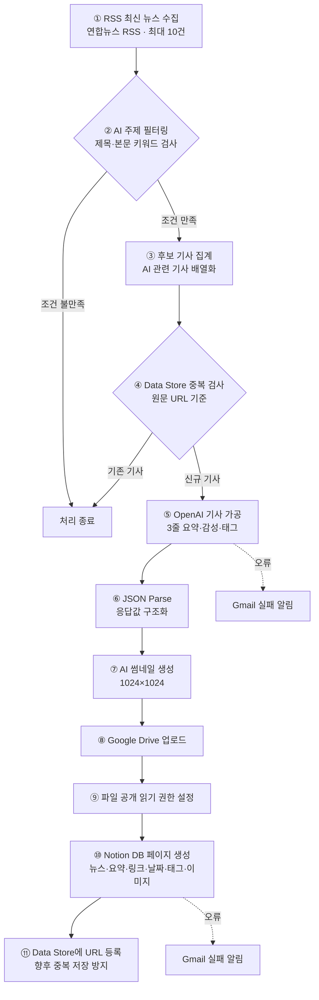

# AI 기술 뉴스 요약 자동화 파이프라인

> **Make 기반 노코드 자동화 팀 프로젝트 제출 문서**

| 항목 | 내용 |
|---|---|
| 제출 워크플로우 | `test11.blueprint (1).json` |
| 자동화 도구 | **Make** |
| 주요 연동 | 연합뉴스 RSS · OpenAI · Google Drive · Notion · Gmail · Make Data Store |
| 팀원 | 김승현 · 이태우 · 한승학 · 공미순 · 최슬기 (5인) |

---

## 목차

1. [프로젝트 개요](#1-프로젝트-개요)
2. [전체 워크플로우 한눈에 보기](#2-전체-워크플로우-한눈에-보기)
3. [단계별 구현 내용](#3-단계별-구현-내용)
4. [주제 필터링 기준](#4-주제-필터링-기준)
5. [OpenAI 가공 설계](#5-openai-가공-설계)
6. [보너스 기능 구현](#6-보너스-기능-구현)
7. [Notion 데이터베이스 저장 구조](#7-notion-데이터베이스-저장-구조)
8. [중복 방지 설계](#8-중복-방지-설계)
9. [오류 처리 정책](#9-오류-처리-정책)
10. [팀원별 역할 및 수행 결과](#10-팀원별-역할-및-수행-결과)
11. [요구사항 충족 현황](#11-요구사항-충족-현황)
12. [테스트 시나리오](#12-테스트-시나리오)
13. [보안 및 개인정보 보호](#13-보안-및-개인정보-보호)
14. [운영 시 유의사항 및 개선 방향](#14-운영-시-유의사항-및-개선-방향)
15. [제출 산출물 체크리스트](#15-제출-산출물-체크리스트)
16. [프로젝트 요약](#16-프로젝트-요약)
17. [부록: 워크플로우 및 구현 화면](#17-부록-워크플로우-및-구현-화면)

---

## 1. 프로젝트 개요

여러 뉴스 사이트를 사람이 직접 확인하고 내용을 복사·정리하는 반복 업무를 줄이기 위해 제작한 **AI 기술 뉴스 수집·요약·저장 자동화 시스템**입니다.

매일 정해진 시간에 RSS에서 최신 뉴스를 수집한 뒤 AI 관련 기사만 선별하고, OpenAI로 핵심 내용을 3줄로 요약합니다. 이어서 감성 분석과 태그를 생성하고, 기사 주제를 표현한 썸네일까지 자동 제작하여 Notion 데이터베이스에 저장합니다.

### 핵심 목표

| # | 목표 |
|---:|---|
| 1 | RSS 기반 최신 기술 뉴스 자동 수집 |
| 2 | AI 관련 뉴스만 키워드로 선별 |
| 3 | 동일 기사 중복 처리 방지 |
| 4 | 기사 1건을 OpenAI로 3줄 요약 |
| 5 | 감성 분석 및 태그 자동 생성 |
| 6 | 뉴스 주제 기반 썸네일 자동 생성 |
| 7 | Notion 데이터베이스 자동 저장 |
| 8 | OpenAI·Notion 오류 발생 시 관리자 이메일 알림 |
| 9 | 사람의 개입을 최소화한 End-to-End 자동화 |

---

## 2. 전체 워크플로우 한눈에 보기



### 데이터 흐름 요약

```
RSS 뉴스 → AI 키워드 필터 → URL 중복 검사 → OpenAI 3줄 요약·감성·태그
        → JSON 구조화 → 썸네일 생성 → Google Drive 업로드·공유
        → Notion 저장 → 처리 URL 기록
```

---

## 3. 단계별 구현 내용

| 순서 | Make 모듈 | 모듈 ID | 주요 기능 | 입력 → 출력 |
|---:|---|---:|---|---|
| 1 | RSS · Watch RSS feed items | 1 | 연합뉴스 RSS 최신 뉴스 최대 10건 수집 | RSS → 제목·본문·URL·발행일 |
| 2 | Router | 2 | AI 관련 처리 경로 분기 | 수집 기사 → AI 조건 경로 |
| 3 | Basic Aggregator | 27 | 키워드 조건을 만족한 기사 집계 | 개별 기사 → 기사 배열 |
| 4 | Data Store · Check existence | 28 | URL 기준 기존 처리 여부 확인 | 기사 URL → 존재 여부 |
| 5 | OpenAI · Create a Completion | 3 | 3줄 요약, 감성, 태그 생성 | 기사 제목·본문 → JSON 문자열 |
| 6 | JSON · Parse JSON | 4 | AI 응답을 매핑 가능한 필드로 분리 | JSON 문자열 → summary/sentiment/tags |
| 7 | OpenAI · Generate an Image | 32 | 요약 내용을 기반으로 썸네일 생성 | 요약문 → 이미지 파일 |
| 8 | Google Drive · Upload a File | 44 | 생성 이미지를 지정 폴더에 업로드 | 이미지 → Drive 파일 ID |
| 9 | Google Drive · Share a File | 45 | 링크로 이미지를 표시할 수 있도록 읽기 권한 부여 | 파일 ID → 공개 읽기 링크 |
| 10 | Notion · Create a Page | 13 | 가공 결과를 뉴스 DB에 저장 | 기사·AI 결과·이미지 → DB 페이지 |
| 11 | Data Store · Add a Record | 30 | 저장 완료된 기사 URL 기록 | URL → 중복 방지 키 |
| 오류 | Gmail · Send an Email | 43 | OpenAI 처리 실패 알림 | 오류 정보 → 관리자 메일 |
| 오류 | Gmail · Send an Email | 20 | Notion 저장 실패 알림 | 오류 정보 → 관리자 메일 |

---

## 4. 주제 필터링 기준

기사의 **제목 또는 본문(description)** 에 아래 키워드가 포함되면 AI 뉴스 후보로 선별합니다.

| 구분 | 적용 키워드 |
|---|---|
| 영문 | `AI`, `LLM`, `GPT`, `Machine Learning` |
| 한글 | `인공지능`, `딥러닝` |
| 검사 대상 | 기사 제목 + 기사 본문 |
| 조건 방식 | 키워드 중 하나 이상 포함 시 통과 |

**선정 이유**

1. **AI**, **인공지능**은 국내 기술 뉴스에서 가장 일반적으로 사용되는 핵심 표현입니다.
2. **LLM**, **GPT**는 생성형 AI 관련 기사를 효과적으로 식별할 수 있습니다.
3. **Machine Learning**, **딥러닝**을 추가하여 'AI'라는 단어가 직접 포함되지 않은 기술 기사도 포착합니다.
4. 필터링을 OpenAI 호출 전에 수행하여 불필요한 API 사용과 비용을 줄입니다.

---

## 5. OpenAI 가공 설계

### 사용 모델 및 설정

| 항목 | 설정값 |
|---|---|
| 모델 | `gpt-4o-mini` |
| 응답 형식 | JSON Object |
| Temperature | `0.2` |
| 최대 출력 토큰 | `500` |
| 입력 본문 길이 | 최대 3,000자 |
| 처리 기사 | 집계된 후보 중 첫 번째 기사 1건 |

### AI 출력 구조

```json
{
  "summary": ["1줄 요약", "2줄 요약", "3줄 요약"],
  "sentiment": "positive | neutral | negative",
  "tags": ["태그1", "태그2"]
}
```

### 프롬프트 품질 관리 규칙

- 요약은 **정확히 3개 항목**으로 생성
- 각 요약문은 **60자 이내**
- 기사에 없는 정보는 추측하지 않음
- 마크다운 코드 블록을 사용하지 않음
- JSON 이외의 설명을 출력하지 않음
- 낮은 Temperature를 사용하여 결과의 일관성을 강화

---

## 6. 보너스 기능 구현

### 6.1 뉴스 썸네일 자동 생성

OpenAI 이미지 생성 모듈을 사용하여 3줄 요약 내용을 기반으로 뉴스 주제를 표현하는 썸네일을 생성합니다.

| 항목 | 설정 |
|---|---|
| 이미지 모델 | `gpt-image-1-mini` |
| 크기 | `1024 × 1024` |
| 생성 수량 | 1장 |
| 스타일 | 심플하고 미니멀한 플랫 일러스트 |
| 텍스트 포함 | 없음 |

생성된 이미지는 Google Drive에 업로드한 후 읽기 권한을 설정하고, Drive 파일 ID로 이미지 URL을 구성하여 Notion의 썸네일 속성에 저장합니다.

### 6.2 감성 분석 및 태그 생성

별도의 AI 호출을 추가하지 않고, 기사 요약을 수행하는 **한 번의 OpenAI 호출 안에서** 감성과 태그를 함께 반환하도록 설계했습니다.

- 감성 분류: `positive`, `neutral`, `negative`
- 주제 태그: 기사 내용을 대표하는 키워드 2개
- 장점: 기사당 텍스트 AI 호출 1회 원칙을 유지하면서 부가 분석 수행

---

## 7. Notion 데이터베이스 저장 구조

| Notion 속성 | 저장 데이터 | 데이터 출처 |
|---|---|---|
| 제목 | 기사 제목 | RSS |
| 카테고리 | `AI` | 고정값 |
| 요약문 | 3줄 요약을 줄바꿈으로 결합 | OpenAI |
| 원문 링크 | 기사 URL | RSS |
| 발행 일시 | RSS 발행일 | RSS |
| 감성 태그 | positive / neutral / negative | OpenAI |
| 주제 태그 | AI가 생성한 태그 목록 | OpenAI |
| 썸네일 | Google Drive 공개 이미지 URL | OpenAI Image + Drive |

### 핵심 매핑 예시

```
제목      ← RSS.title
요약문    ← join(OpenAI.summary, 줄바꿈)
원문 링크 ← RSS.url
발행 일시 ← RSS.dateCreated
감성      ← OpenAI.sentiment
태그      ← OpenAI.tags
썸네일    ← Google Drive 이미지 URL
```

---

## 8. 중복 방지 설계

중복 방지 키는 기사마다 고유성이 높은 **원문 URL**을 사용합니다.

```
처리 전  : Data Store에서 URL 존재 여부 확인
처리 후  : Notion 저장 완료 시 URL을 Data Store에 등록
다음 실행 : 동일 URL이 확인되면 처리 대상에서 제외
```

**URL을 선택한 이유**

- RSS의 기사 URL은 동일 기사에 대해 비교적 안정적인 고유값으로 사용 가능
- 별도의 해시 생성 없이 구현 가능
- 저장 및 조회 구조가 단순하여 유지보수가 쉬움
- 기사 제목이 수정되더라도 URL이 같으면 중복 저장을 방지할 수 있음

> ⚠️ **최종 제출 전 확인 필요**
> 현재 Blueprint의 OpenAI 앞 필터는 `Data Store 존재 여부 ≠ False`로 저장되어 있습니다. 신규 기사만 처리하려는 의도라면 실제 Make 화면에서 조건이 **존재 여부 = False** 또는 이에 해당하는 논리로 설정되어 있는지 실행 로그와 함께 재확인해야 합니다.

---

## 9. 오류 처리 정책

### 현재 구현된 오류 경로

| 오류 발생 단계 | 처리 방법 |
|---|---|
| OpenAI 요약 실패 | 오류 처리 경로로 이동 후 Gmail 알림 발송 |
| Notion 페이지 생성 실패 | 오류 처리 경로로 이동 후 Gmail 알림 발송 |
| 관리자 정보 | 제출 문서에서는 개인정보 보호를 위해 마스킹 |

### 설계 의도

- 핵심 외부 API에서 오류가 발생했을 때 운영자가 즉시 인지
- 오류가 발생한 단계를 메일 제목으로 구분
- 정상 데이터만 중복 방지 Data Store에 기록
- 실패 후 무한 반복되지 않도록 시나리오 오류 상한 관리

> ⚠️ **재시도 정책 검증 필요**
> Blueprint 메타데이터의 `maxErrors: 2`와 오류 알림 경로는 확인되지만, OpenAI·Notion 모듈에 명시적인 `Retry` 모듈 또는 최대 2회 재실행 경로가 직접 구성된 형태는 확인되지 않습니다. "재시도 최대 2회"를 충족했다고 제출하려면 Make 실행 설정 또는 오류 처리 경로의 재시도 동작을 실행 이력으로 증빙해야 하며, 증빙이 없다면 현재 구현은 **오류 감지·알림 중심**으로 설명하는 것이 정확합니다.

---

## 10. 팀원별 역할 및 수행 결과

| 팀원 | 담당 영역 | 주요 수행 내용 | 주요 산출물 |
|---|---|---|---|
| **김승현** | 데이터 수집 및 조건 필터링 | 연합뉴스 RSS 피드 연결 · 최신 뉴스 최대 10건 수집 설정 · AI 키워드 필터 설계 · URL 기반 중복 검사 Data Store 구성 · 불필요한 OpenAI 호출을 줄이기 위한 전처리 | RSS 모듈, Router, 키워드 필터, Data Store 조회 |
| **이태우** | AI Prompt Engineering 및 텍스트 구조화 | 3줄 요약 System/User Prompt 설계 · 60자 제한 및 추측 금지 규칙 적용 · JSON Object 응답 형식 지정 · `summary`/`sentiment`/`tags` 구조 설계 · Parse JSON을 통한 데이터 구조화 | OpenAI Completion, JSON Schema, Parse JSON 매핑 |
| **한승학** | 보너스 기능 및 확장 가공 | 뉴스 요약 기반 AI 썸네일 생성 · Google Drive 이미지 업로드 및 공유 권한 설정 · 감성 분석 결과 자동 분류 · 주제 태그 자동 생성 · Notion 썸네일 연동을 위한 이미지 URL 가공 | OpenAI Image, Google Drive Upload/Share, 감성·태그 필드 |
| **공미순** | Notion 저장소 및 오류 처리 | Notion 뉴스 데이터베이스 속성 설계 · 기사 제목·요약·URL·발행일·감성·태그·이미지 매핑 · OpenAI/Notion 오류 처리 경로 구성 · 최종 실패 시 관리자 이메일 알림 설정 · 저장 완료 후 URL을 Data Store에 등록 | Notion Create Page, Gmail 알림, Data Store Add Record |
| **최슬기** | 총괄 QA, 통합 테스트 및 문서화 | 전체 모듈 연결 관계 검토 · End-to-End 실행 흐름 확인 · 과제 요구사항과 실제 Blueprint 대조 · API Key·토큰·이메일 등 보안정보 마스킹 · 제출용 README 및 검증 항목 정리 | 통합 검증표, 테스트 시나리오, 제출 문서 |

---

## 11. 요구사항 충족 현황

**범례:** ✅ 구현 확인 &nbsp;|&nbsp; △ 실행 화면 또는 추가 검증 필요 &nbsp;|&nbsp; ❌ 미구현

| 과제 요구사항 | 상태 | 구현 근거 |
|---|:---:|---|
| RSS로 기술 뉴스 수집 | ✅ | 연합뉴스 RSS Watch 모듈 |
| 매일 설정 시간 자동 실행 | △ | 모듈 명칭에 09:00 KST 표기, 실제 Scenario Scheduling 화면 캡처 필요 |
| 사전 정의 주제 기사 1건 선택 | ✅ | AI 키워드 필터 + Aggregator 첫 번째 기사 사용 |
| AI로 3줄 이내 요약 | ✅ | 정확히 3개 요약 항목을 요구하는 프롬프트 |
| 기사당 텍스트 AI 호출 1회 | ✅ | 요약·감성·태그를 단일 Completion에서 처리 |
| Notion DB 자동 저장 | ✅ | Notion Create a Page |
| 제목·요약·링크·발행일 매핑 | ✅ | Notion 필드 매핑 확인 |
| 사람 개입 없는 자동 처리 | ✅ | 모듈 간 자동 연결 |
| 뉴스 미수집·오류 처리 | △ | OpenAI·Notion 오류 알림 구현, 빈 RSS 전용 경로는 별도 확인 필요 |
| 동일 기사 중복 방지 | △ | URL Data Store 구현, 존재 여부 필터 논리 재확인 필요 |
| 재시도 최대 2회 | △ | 오류 상한 설정 확인, 명시적 재시도 동작 증빙 필요 |
| API Key·토큰 비노출 | ✅ | Blueprint 연결 ID만 사용, 제출 화면 추가 마스킹 필요 |
| 보너스: 썸네일 생성 | ✅ | OpenAI Image + Google Drive + Notion |
| 보너스: 감성 분석 | ✅ | sentiment 필드 생성 및 Notion 저장 |

---

## 12. 테스트 시나리오

| # | 시나리오 | 입력 조건 | 기대 결과 |
|---:|---|---|---|
| 1 | 정상 AI 기사 처리 | RSS에 AI 키워드 포함 신규 기사 존재, Data Store에 동일 URL 없음 | AI 기사 선별 → 3줄 요약·감성·태그 생성 → 썸네일 생성·업로드 → Notion 저장 → URL Data Store 등록 |
| 2 | 비관련 기사 필터링 | 제목·본문에 지정된 AI 키워드 없음 | OpenAI 호출 없이 처리 종료, Notion 미저장, 불필요 API 비용 없음 |
| 3 | 중복 기사 차단 | Data Store에 동일 기사 URL 이미 존재 | OpenAI·이미지 생성 모듈 미호출, Notion 중복 페이지 미생성 (검증 포인트: 신규 기사 조건 동작 여부 실행 로그 확인) |
| 4 | OpenAI 오류 | OpenAI API 연결 오류 또는 호출 실패 | 정상 저장 경로 중단, 관리자에게 OpenAI 단계 실패 메일 발송, 실패 URL 미등록 |
| 5 | Notion 저장 오류 | Notion 연결 또는 데이터베이스 권한 오류 | 관리자에게 Notion 단계 실패 메일 발송, 실패 URL Data Store 미등록 |
| 6 | 썸네일 포함 저장 | 이미지 생성 및 Google Drive 업로드 정상 완료 | Drive 파일 읽기 가능 상태 설정, Notion 썸네일 속성에 이미지 정상 표시 |

---

## 13. 보안 및 개인정보 보호

- OpenAI API Key, Notion Token, Google OAuth 정보는 Make Connection 내부에 저장
- README와 스크린샷에 API Key·Token을 노출하지 않음
- Blueprint에 포함된 개인 이메일은 제출 화면과 문서에서 마스킹
- Google Drive 공유 권한은 이미지 표시 목적의 읽기 전용으로 제한
- 저장소를 공개할 경우 Blueprint 내 Connection 및 데이터베이스 식별자도 추가 점검

---

## 14. 운영 시 유의사항 및 개선 방향

| # | 항목 | 조치 내용 |
|---:|---|---|
| 1 | 중복 검사 필터 논리 재확인 | 신규 기사만 통과하도록 `exist = false` 조건을 실행 로그로 확인 |
| 2 | 스케줄 실행 증빙 추가 | Make Scenario Scheduling 화면에서 `매일 09:00`, `Asia/Seoul` 설정 캡처 |
| 3 | 재시도 최대 2회 증빙 | 오류 처리기의 Retry/Break 설정 또는 Make 자동 재시도 실행 이력 첨부 |
| 4 | RSS 미수집 처리 보강 | 필터 통과 기사가 0건일 때 정상 종료 또는 별도 로그를 남기는 경로 명시 |
| 5 | 이미지 공개 범위 검토 | `Anyone with the link` 대신 조직 내 공유 또는 이미지 호스팅 방식 적용 검토 |
| 6 | 데이터 입력 안정성 강화 | RSS 본문이 비어 있는 경우 summary 등 다른 필드로 대체하는 fallback 로직 추가 |

---

## 15. 제출 산출물 체크리스트

- [x] Make Blueprint JSON
- [x] 팀원별 역할 분담 문서
- [x] 워크플로우 설명 README
- [x] Make 전체 워크플로우 스크린샷 ([부록 A](#부록-a-make-워크플로우-전체-화면) 참고)
- [ ] Scenario Scheduling 설정 스크린샷
- [ ] 정상 실행 History 스크린샷
- [x] Notion DB 저장 결과 스크린샷 ([부록 B](#부록-b-notion-db-저장-결과) 참고)
- [ ] 중복 기사 차단 테스트 증빙
- [ ] 오류 알림 이메일 테스트 증빙
- [ ] API Key·Token·개인 이메일 마스킹 최종 확인

---

## 16. 프로젝트 요약

본 시스템은 RSS에서 최신 뉴스를 수집하고, AI 주제 필터링과 URL 중복 검사를 거쳐 OpenAI로 3줄 요약·감성·태그를 생성합니다. 이어서 뉴스 주제 기반 썸네일을 자동 제작하고 Google Drive를 통해 Notion에 연결하며, 최종 결과를 데이터베이스에 저장합니다.

기본 요구사항인 **수집 → 필터링 → AI 가공 → 자동 저장 → 오류 처리**를 하나의 Make 시나리오로 연결했으며, 선택 과제인 **썸네일 이미지 생성**과 **감성 분석 태그**까지 통합했습니다.

최종 제출 전에는 아래 3가지를 실행 화면과 로그로 추가 검증하면 평가자가 전체 설계와 구현 완성도를 더욱 명확하게 확인할 수 있습니다.

1. 중복 검사 조건 (`exist = false`)
2. 실제 스케줄 실행 (매일 09:00 KST)
3. 최대 2회 재시도 동작

---

## 17. 부록: 워크플로우 및 구현 화면

### 부록 A. Make 워크플로우 전체 화면

RSS 수집부터 Notion 저장까지 전체 13개 모듈이 연결된 실제 Make 시나리오 화면입니다.


| 구간 | 포함 모듈 |
|---|---|
| 수집·필터링 | RSS Watch(1) → 라우터(2) → Data Store 중복확인(28) / Array Aggregator(27) |
| AI 가공 | OpenAI Completion(3) → JSON Parse(4) |
| 썸네일 생성 | OpenAI Generate Images(32) → Google Drive Upload(44) → Google Drive Share Link(45) |
| 저장 | Notion Create a Database Item(13) → Data Store Add Record(30) |
| 오류 알림 | Gmail Send an Email(43, 20) |

### 부록 B. Notion DB 저장 결과

실제 실행 후 Notion "뉴스 아카이브" 데이터베이스에 저장된 결과 화면입니다. 제목·요약문·카테고리·원문링크·발행일시·감성·태그·썸네일까지 모든 속성이 정상적으로 채워진 것을 확인할 수 있습니다.


